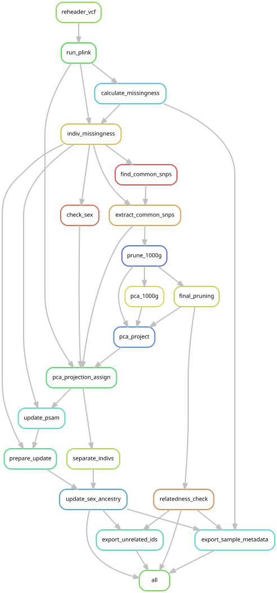
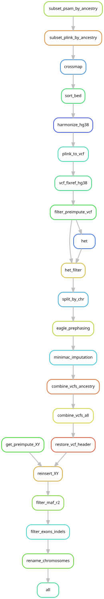

# Imputation

This workflow starts with a VCF file containing measured genotypes and imputes missing variants based on data from the 1000 Genomes Project.
Strictly speaking, this repo contains not one but two workflows: 1) a quality control workflow that filters SNPs and checks sex and ancestry annotations against the provided genotype information, and 2) an imputation workflow that imputes missing variants using data from the 1000 Genomes Project as a reference.
Imputed variants are further filtered to exclude indels and SNPs outside exonic regions, as well as variants with low minor allele frequencies (MAF) or poor correlation scores.

These workflows are intermediate steps in SNP demultiplexing with demuxafy, which uses the SNP profiles in the final VCF file to assign cells to donors in multiplexed pool of cells that have been captured together with 10X Chromium.

# Overview

The `plink_qc` and `imputation` workflows in this repo are the second and third stages in the `demuxafy` SNP demux process, as shown below.

TODO: insert DAG

Rule graphs for each stage are shown below. 
See the individual rule definitions to understand the function of each rule.

## Plink QC

This stage starts with the following outputs from the [genotyping](url):
- VCF: genotype calls for all samples, based on raw SNP microarray data
- psam: a sample description file, ready for processing by `plink`
- id map: `plink` is fussy about sample ids, so this file maps the original sample ids to the adjusted ids in the `.psam` file

The output of this stage is an updated set of plink files:
- pgen: genotype information in plink format
- pvar: ?
- psam: an updated version of the sample description file, in which sex annotations have been double checked and ancestries have been assigned based on the 1000 Genomes reference
- unrelated_sample_ids.txt: the largest set of post-QC samples in which no pair is related (KING `--king-cutoff`); used downstream for variant statistics
- derived_sample_metadata.csv: per-sample sex, inferred ancestry, kinship group and genotyping call rate

### Related samples

No sample is removed by the sex, ancestry or relatedness checks.
A sample that fails the sex or ancestry check has its annotation corrected instead: sex to the value inferred from the genotypes, ancestry to the PCA assignment.
Related samples (in practice, repeat arrays of the same donor) also stay: the final VCF is used for SNP demultiplexing, so every array a donor has must remain available downstream.
So that repeat arrays don't distort the variant statistics (HWE, MAF), those are computed on the unrelated subset only (`unrelated_sample_ids.txt`) and the resulting variant filters are applied to all samples (see rule `filter_preimpute_vcf`).
The exception is per-variant missingness, which measures probe quality: every array is an independent observation of that, so it is taken over all samples.
In the metadata, arrays of the same donor (kinship at or above `king_duplicate_cutoff`; repeat arrays or identical twins) share a `kinship_group`, and `genotype_call_rate` gives a basis for choosing among them.
The default cutoff (0.3) sits below the textbook same-person value (~0.35) because tumour arrays lose heterozygous sites (loss of heterozygosity), which lowers a donor's tumour–blood kinship, while staying well above the 0.25 expected for parent–child or sibling pairs.

The rule graph is as follows:

## Imputation

